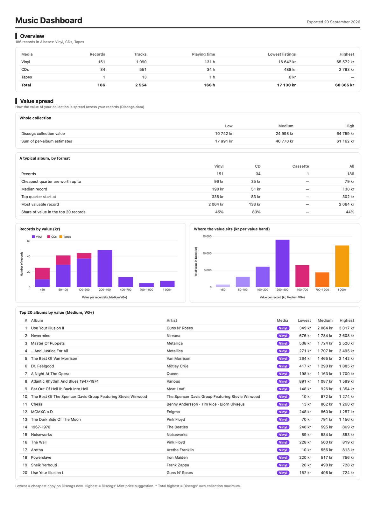
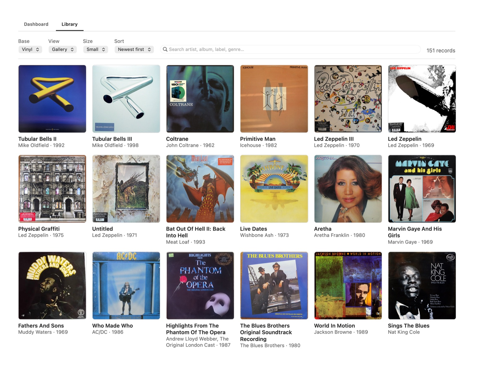
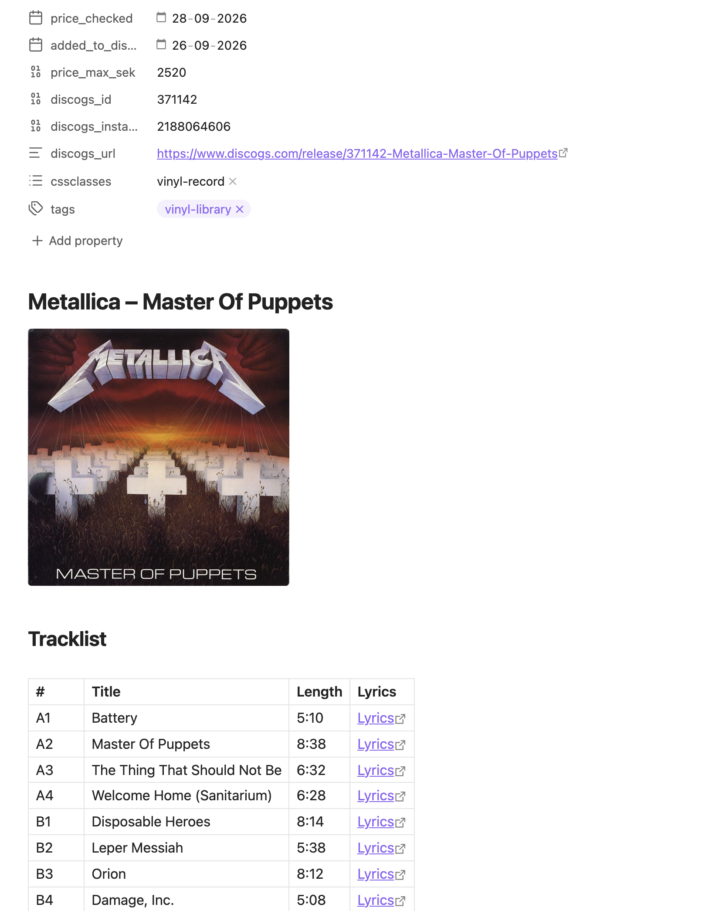
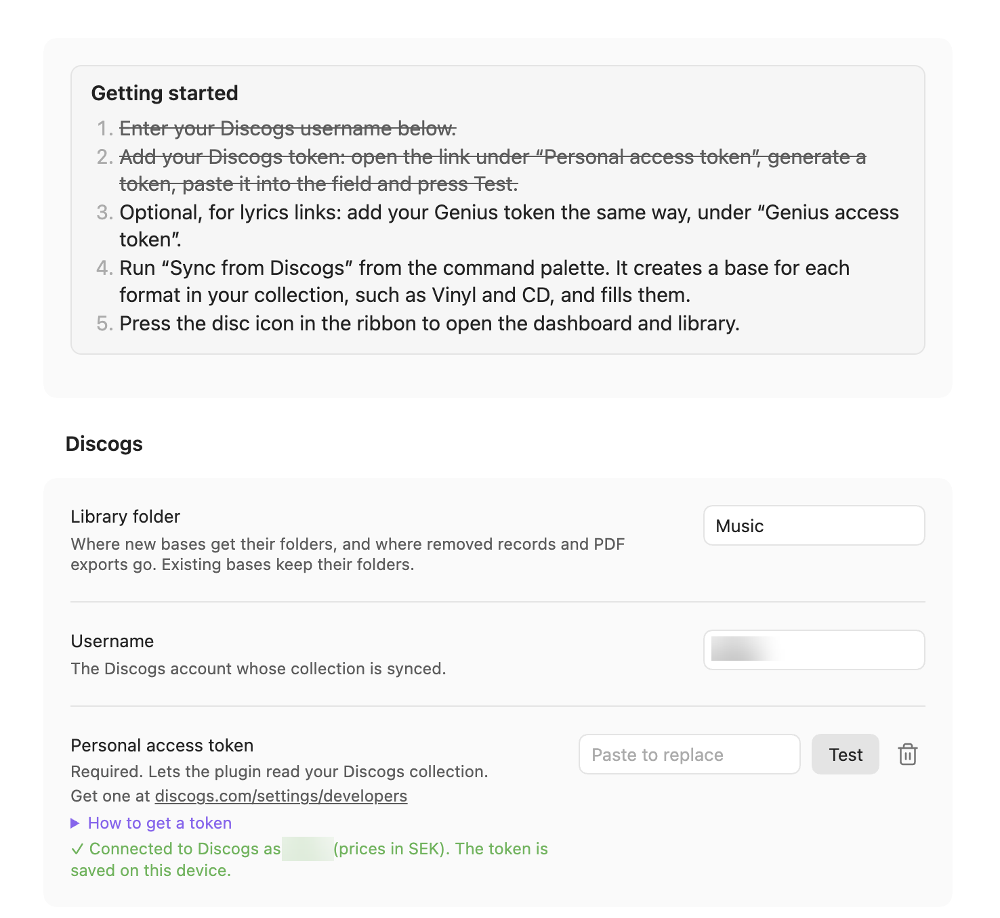
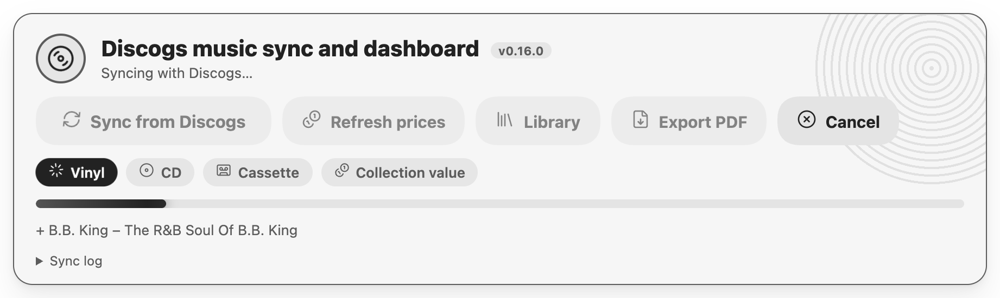

# Discogs music sync and dashboard

An Obsidian plugin that turns your Discogs collection into a music library in your vault: one note per record, with a Music Dashboard and a Music Library built in. It needs no other plugin, and puts nothing in your vault except your record notes, their images and the PDFs you export.

It is in Obsidian's community plugins: **[Discogs music sync and dashboard](https://community.obsidian.md/plugins/discogs-music-sync)**.

The repository is *Discogs Music Sync to Obsidian*. The plugin's ID, and its folder in `.obsidian/plugins/`, is `discogs-music-sync`.





## Features

- **One note per record.** Each note gets the front cover and every other Discogs photo, the tracklist with track lengths, label, catalogue number, country, format, genres and styles, your media and sleeve condition, and Discogs price data in your currency.
- **Genius lyrics links.** Each track links to its lyrics on Genius where a match is found.
- **Bases, sorted by format.** The first sync creates a base for each format in your collection (Vinyl, CD, Cassette…), each with its own folder and tag, and later syncs do the same for new formats. Every record goes to the base for its format, from anywhere in your Discogs collection: you don't need to file records into folders on Discogs, and formats are Discogs' own names, never typed. You can rename a base, give one base several formats, or stop syncing one.
- **Safe syncing.** A sync only adds records. It never rewrites an existing note: only **Refresh prices** and **Update this record** change one, and only the fields that come from Discogs. Records you remove from Discogs are moved to a *Removed from collection* folder, never deleted.
- **Your currency.** Prices, values and charts in any currency Discogs prices in, starting from your Discogs account's.
- **Price refresh.** Updates only the price fields on every record, leaving everything else alone.
- **Update a record.** Brings one note up to date with Discogs (conditions graded later, corrected details, lyrics links) without touching what you wrote.
- **One Music view, two tabs.** The disc icon opens the plugin's own view, with the sync panel at the top and a Dashboard tab and a Library tab.
- **Dashboard.** Thirteen sections, drawn by the plugin: overview, growth over time (records owned and the collection's value), value spread with a typical album per format, the market (rarest, in demand, easiest to replace), what's in the collection, pressings (countries, labels, reissues, compilations), decades, top artists, playing time, buying, listening, condition and what needs filling in. Turn any section off in settings. Albums open their notes.
- **Colours.** Charts follow your theme, or use the original full colours, or colours you choose for each base.
- **Library.** Browse your records by base: a gallery of covers, by genre, a catalogue table or a value table, with search and sorting.
- **PDF export.** Saves the dashboard as a PDF in the paper size and orientation you choose.
- **Sync panel.** Buttons, progress and a log at the top of the dashboard, or in any note through a `music-sync` code block.
- **Guided setup.** A Getting started list in settings, crossed off as you go, with links to where the Discogs and Genius tokens are made and the steps to make them.






## Requirements

- Obsidian 1.13 or later, desktop only (macOS, Windows or Linux).
- A Discogs account and a personal access token.
- Optional: a Genius API access token, for lyrics links.

No other plugin is needed.

## Installation

**From Obsidian** (recommended). Open **Settings → Community plugins → Browse**, search for **Discogs music sync**, then choose **Install** and **Enable**. Or open [its page in the community plugins](https://community.obsidian.md/plugins/discogs-music-sync) and install it from there. Obsidian keeps it up to date.

**From a release.** Download `main.js`, `manifest.json` and `styles.css` from the [latest release](https://github.com/anthonyfitzpatrick/discogs-music-sync-to-obsidian/releases/latest), put them in `<your vault>/.obsidian/plugins/discogs-music-sync/`, then enable **Discogs music sync and dashboard** in **Settings → Community plugins**.

**With BRAT** (to try a version before it reaches the community plugins). Install the BRAT community plugin, choose **Add beta plugin**, and enter `anthonyfitzpatrick/discogs-music-sync-to-obsidian`. BRAT installs the latest release and keeps it updated.

## Quick start

1. Open **Settings → Discogs music sync and dashboard** and follow **Getting started** at the top. Optionally choose the **Library folder** (`Music` unless you change it).
2. Enter your Discogs username. Paste your personal access token (the link under the field goes to the page that makes one) and press **Test**. Do the same for a Genius token if you want lyrics links.
3. Press the disc icon in the ribbon to open **Music**, and press **Sync from Discogs**. The sync creates a base for each format in your collection (Vinyl, CD, Cassette…) and fills it.
4. Switch between the **Dashboard** and **Library** tabs to see your collection.




The [User Guide](User%20Guide.md) covers every feature and setting in detail.

## Privacy and security

- The plugin talks only to `api.discogs.com` and `api.genius.com`, and only when you start a sync, a price or value refresh or a record update, set up or edit bases, or test a token.
- Tokens are kept in Obsidian's keychain for the vault on this device, encrypted by the operating system on macOS, Windows and Linux: never in a file, the vault or the plugin's `data.json`, so never in git or a shared sync. **Remove** and **Start again** in settings clear them.
- Nothing is sent anywhere else, and there is no telemetry.

## Known limitations

- Discogs gives price suggestions and the collection's value only in your Discogs account's currency. For another currency the plugin converts them at Discogs' own rate, measured from a record's cheapest listing in both currencies.
- Discogs price suggestions (the Low, Mid, High and Mint estimates) only appear once your Discogs Seller Settings are filled in. Without them, the dashboard uses the cheapest current listing instead.
- Renaming a base doesn't move its notes to a folder of the new name.
- Tokens are kept per vault and per device: enter them in each vault, on each computer, where you sync.
- Desktop only, because PDF export uses Electron.

## Feedback

Use **Report a bug** or **Request a feature** at the bottom of the plugin's settings page. They open this repository's issue forms, which label the issue `bug` or `enhancement` automatically.

## Development

The source is TypeScript in `src/`, checked in strict mode: `main.ts` (the plugin), `engine.ts` (syncing with Discogs), `views.ts` (the Music view), `report.ts` (the dashboard and PDF), `settings.ts` and `modals.ts` (settings and dialogs), with the Discogs replies decoded in `discogs.ts` and JSON values typed in `json.ts`. `npm run build` bundles it into `main.js`; the tests run on `src/` directly, as Node reads TypeScript.

```
npm install      # also points git at the pre-commit hook in hooks/
npm run lint     # oxlint (anti-slop rules), tsc (strict types), then eslint (Obsidian's plugin review rules)
npm test         # builds, then runs the tests in tests/
npm run check    # both
```

Lint type-checks the source with `tsc` and runs two rule sets, all with warnings treated as errors: the [anti-slop](https://github.com/dmmulroy/anti-slop) rules, vendored in `tools/oxlint/anti-slop/` and configured in `oxlint.config.mts`, and the rules Obsidian's plugin review uses ([eslint-plugin-obsidianmd](https://github.com/obsidianmd/eslint-plugin)), configured in `eslint.config.mjs`. The pre-commit hook and CI both run lint and the tests.

To release, set the same version in `manifest.json`, `package.json`, `versions.json` (mapped to the minimum Obsidian version) and `VERSION` in `src/version.ts`; a test checks they agree. Commit, then push a tag with that version (for example `0.16.0`). GitHub Actions tests the build and publishes a release with `main.js`, `manifest.json` and `styles.css`. Pushing a tag publishes: push branches only until a release is wanted.

## License

MIT. See [LICENSE](LICENSE).

Created by Anthony Fitzpatrick, Wolf 359 Press AB.
